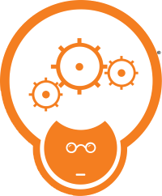

CodeMash 2022   
============

CodeMash 2022 session decks, sample code, links and other stuff.

Speakers: please feel free to send me pull requests with any of your content that you want to share with the CodeMash attendees.  This way we have a single place for attendees to go and get content.

Organization: fork this repository and put your session materials, links or anything else in a subdirectory named with the same name as your session. Then send a pull request and I will merge it in. See the [sample](0-Sample) for an example of how it could work.

---

*Note that this is a volunteer effort and is not representing CodeMash in any official way. Thanks!